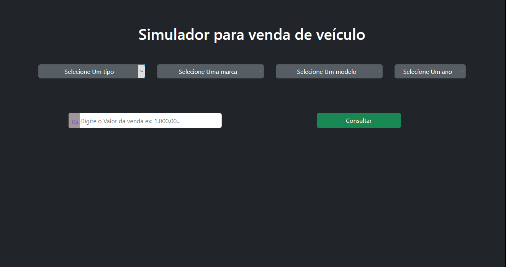

<h1 align="center">Simulador de Vendas</h1>

 <a href="#Descrição">Descrição</a> •
 <a href="#Tecnologias">Tecnologias</a> • 
 <a href="#Lembretes">Licença</a> • 
 <a href="#Notas do Desenvolvedor">Autor</a>

## 🎈 Descrição 🎈
um simulador de vendas de carros que consome a API da Fipe para basear seus dados. 

## 🔗 Tecnologias 🔗
Para realizar esse projeto foi utilizado as seguintes tecnologias:

Node

Angular

JavaScript

TypeScript

Bootstrap

## 👀 Lembretes 👀
O projeto funciona em `LocalHost`. 

Lembre-se de checar se o pacote `node` está instalado em seu computador. 
Abra o `CMD` na pasta do projeto e digite o seguinte comando `npm install`, espere baixar as dependencias e logo após utilizar o `ng serve`. prontinho 😁 o site estará funcionando na porta `4200` então abra seu navegador e digite `http://localhost:4200`.

## 🚧 Status do projeto 🚧
Projeto Finalizado (mas sempre podemos melhorar :D)
## 📸Imagens do Projeto 📸

<h1 align="center">Informações do Dev 😁💻</h1>

<a href="https://black598.github.io/Portifolio/">Portifolio</a> •
<a href="https://twitter.com/BlackG598">Twitter</a> •
<a href="https://github.com/Black598">GitHub</a> •
<a href="https://www.linkedin.com/in/douglas-ferreira-dev/">Linkedin</a>

